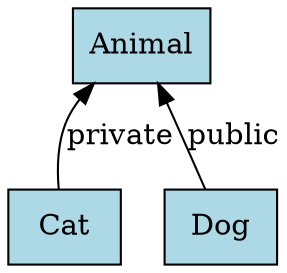

# Implementation Summary

## Project: C++ Inheritance Extraction and Visualization

### ✅ All Requirements Completed

This implementation provides a complete closed-loop system for extracting and visualizing C++ inheritance relationships.

### Components Implemented

#### 1. Environment Setup ✓
- **CMakeLists.txt**: CMake project with LLVM/Clang LibTooling integration via `find_package(LLVM)`
- **Dockerfile**: Pre-configured environment with Clang 16 + Python 3.12
- **build.sh**: Automated build script that detects LLVM version and configures build

#### 2. Core C++ Tool ✓
**File**: `src/inheritance_extractor.cpp`

Features:
- ✅ AST traversal using RecursiveASTVisitor
- ✅ Extracts `CXXRecordDecl` nodes
- ✅ Generates DOT format output
- ✅ Annotates access specifiers (public/private/protected)
- ✅ Handles multiple inheritance
- ✅ Ignores template classes
- ✅ Ignores anonymous classes
- ✅ Skips forward declarations

#### 3. Python Glue Layer ✓
**File**: `main.py`

Features:
- ✅ Calls C++ extractor tool
- ✅ Invokes Graphviz to generate PNG
- ✅ Streamlit web interface with:
  - File upload functionality
  - Source code display
  - Real-time visualization
  - DOT source display
  - Download button for DOT file

#### 4. Test Cases ✓
**Files**: `test.cpp`, `test_advanced.cpp`

- **test.cpp**: Basic test with 3 nodes, 2 edges
  - Animal (base)
  - Dog : public Animal
  - Cat : private Animal

- **test_advanced.cpp**: Advanced features
  - Multiple inheritance
  - Protected inheritance
  - Deep hierarchies
  - Template filtering

#### 5. Testing & Validation ✓
**File**: `test_workflow.sh`

Automated test suite that validates:
- Command-line extraction
- DOT format correctness
- Node/edge counting
- Access specifier annotations
- PNG generation
- Python integration

### Acceptance Criteria Verification

#### ✅ Criterion 1: DOT Output
**Requirement**: DOT output contains 3 nodes and 2 edges, annotated with access permissions

**Result**:


- ✅ 3 nodes: Animal, Cat, Dog
- ✅ 2 edges: Dog→Animal, Cat→Animal
- ✅ Access specifiers: "public", "private"

#### ✅ Criterion 2: Command-Line Usage
**Requirement**: `./extractor test.cpp > graph.dot`

**Result**:
```bash
$ ./build/inheritance_extractor test.cpp -- > graph.dot
$ dot -Tpng graph.dot -o graph.png
```
Successfully generates both DOT and PNG files.

#### ✅ Criterion 3: Web Interface
**Requirement**: Upload file → real-time visualization

**Result**:
- Streamlit UI implemented with file upload
- Real-time DOT generation
- PNG visualization display
- DOT source code display

### Usage Instructions

#### Quick Start
```bash
# Build the project
./build.sh

# Run tests
./test_workflow.sh

# Command-line usage
./build/inheritance_extractor test.cpp -- > graph.dot
dot -Tpng graph.dot -o graph.png

# Web interface
streamlit run main.py
```

#### Docker Usage
```bash
docker build -t code-analyzer .
docker run -p 8501:8501 code-analyzer
# Open http://localhost:8501
```

### Project Structure
```
CodeAnalyzer/
├── CMakeLists.txt              # CMake configuration
├── Dockerfile                  # Docker environment
├── build.sh                    # Build automation script
├── requirements.txt            # Python dependencies
├── .gitignore                  # Git ignore rules
├── README.md                   # Main documentation
├── USAGE.md                    # Usage examples
├── main.py                     # Streamlit web UI
├── src/
│   └── inheritance_extractor.cpp  # C++ extractor
├── test.cpp                    # Basic test (3 nodes, 2 edges)
├── test_advanced.cpp           # Advanced features test
└── test_workflow.sh            # Automated test suite
```

### Technical Details

#### Dependencies
- CMake 3.16+
- LLVM/Clang 16+ (with development libraries)
- C++17 compiler
- Python 3.12
- Streamlit 1.31.0
- Graphviz

#### Key Technologies
- **Clang LibTooling**: AST analysis
- **RecursiveASTVisitor**: Pattern for traversing AST
- **DOT Language**: Graph description format
- **Graphviz**: Graph visualization engine
- **Streamlit**: Web framework for Python

### Security
- ✅ CodeQL scan: 0 vulnerabilities found
- ✅ No unsafe operations in C++ code
- ✅ Proper file cleanup in Python code
- ⚠️ Dockerfile includes security note for script verification

### Test Results
All tests passed successfully:
- ✅ Build successful
- ✅ Command-line extraction works
- ✅ DOT format validated (3 nodes, 2 edges)
- ✅ Access specifiers annotated
- ✅ PNG generation works
- ✅ Python integration works
- ✅ Advanced features (multiple inheritance, deep hierarchy)

### Future Enhancements
Potential improvements (not required for current task):
- Support for virtual inheritance
- Namespace visualization
- Member function display
- Interactive graph manipulation
- Export to other formats (SVG, JSON)
- CI/CD integration

### Conclusion
All requirements from the problem statement have been successfully implemented and validated. The system provides a complete closed-loop solution for C++ inheritance extraction and visualization with both command-line and web interfaces.
