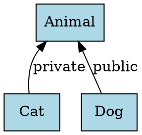

# CodeAnalyzer

C++ 继承关系提取与可视化工具 / C++ Inheritance Relationship Extraction and Visualization Tool

## 功能特性 / Features

- 🔍 **AST分析**: 使用Clang LibTooling遍历AST提取C++类继承关系
- 📊 **DOT生成**: 自动生成Graphviz DOT格式的继承关系图
- 🎨 **可视化**: 使用Graphviz将继承关系渲染为PNG图像
- 🌐 **Web界面**: Streamlit交互式界面，支持文件上传和实时可视化
- 🔐 **访问权限**: 标注public/private/protected继承访问权限
- 🚀 **多重继承**: 支持多重继承关系分析
- 🎯 **智能过滤**: 自动忽略模板类和匿名类

## 系统要求 / Requirements

- CMake 3.16+
- Clang 16 + LLVM 16 development libraries
- Python 3.12
- Graphviz
- C++17 compiler

## 快速开始 / Quick Start

### 方法1: 使用Docker (推荐)

```bash
# 构建Docker镜像
docker build -t code-analyzer .

# 运行容器
docker run -p 8501:8501 code-analyzer

# 在浏览器中访问
open http://localhost:8501
```

### 方法2: 本地构建

#### 1. 安装依赖

**Ubuntu/Debian:**
```bash
# 安装Clang 16和LLVM
wget https://apt.llvm.org/llvm.sh
chmod +x llvm.sh
sudo ./llvm.sh 16

# 安装开发库
sudo apt-get install -y \
    llvm-16-dev \
    libclang-16-dev \
    clang-16 \
    cmake \
    build-essential \
    graphviz \
    python3.12 \
    python3-pip

# 设置环境变量
export LLVM_DIR=/usr/lib/llvm-16/lib/cmake/llvm
export Clang_DIR=/usr/lib/llvm-16/lib/cmake/clang
export PATH="/usr/lib/llvm-16/bin:${PATH}"
```

**macOS:**
```bash
brew install llvm@16 cmake graphviz python@3.12
export LLVM_DIR=$(brew --prefix llvm@16)/lib/cmake/llvm
export Clang_DIR=$(brew --prefix llvm@16)/lib/cmake/clang
```

#### 2. 构建C++工具

```bash
mkdir build
cd build
cmake ..
cmake --build .
cd ..
```

#### 3. 安装Python依赖

```bash
pip install -r requirements.txt
```

## 使用方法 / Usage

### 命令行模式 / Command Line

```bash
# 提取继承关系并生成DOT文件
./build/inheritance_extractor test.cpp -- > graph.dot

# 使用Graphviz生成PNG图像
dot -Tpng graph.dot -o graph.png
```

### Web界面模式 / Web Interface

```bash
# 启动Streamlit应用
streamlit run main.py

# 在浏览器中打开 http://localhost:8501
# 上传C++文件并查看可视化结果
```

## 示例 / Example

### 输入: test.cpp

```cpp
class Animal {
public:
    virtual void speak() {}
};

class Dog : public Animal {
public:
    void speak() override {}
};

class Cat : private Animal {
public:
    void speak() override {}
};
```

### 输出: DOT格式



### 可视化结果

继承关系图将显示:
- 3个节点: Animal, Dog, Cat
- 2条边: Dog → Animal (public), Cat → Animal (private)

## 验收标准 / Acceptance Criteria

✅ DOT输出包含3个节点和2条边，标注访问权限  
✅ 命令行: `./build/inheritance_extractor test.cpp -- > graph.dot`  
✅ Web界面: 上传文件 → 实时显示继承图  

## 项目结构 / Project Structure

```
CodeAnalyzer/
├── CMakeLists.txt              # CMake配置文件
├── Dockerfile                  # Docker构建文件
├── requirements.txt            # Python依赖
├── main.py                     # Streamlit Web界面
├── src/
│   └── inheritance_extractor.cpp  # C++继承关系提取器
├── test.cpp                    # 测试用例
└── README.md                   # 项目文档
```

## 技术栈 / Tech Stack

- **C++17**: 核心提取工具
- **Clang LibTooling**: AST分析
- **CMake**: 构建系统
- **Python 3.12**: 胶水层
- **Streamlit**: Web界面框架
- **Graphviz**: 图形可视化
- **Docker**: 容器化部署

## 开发说明 / Development

### 核心组件

1. **inheritance_extractor.cpp**: 
   - 使用`RecursiveASTVisitor`遍历AST
   - 提取`CXXRecordDecl`节点
   - 生成DOT格式输出

2. **main.py**:
   - 调用C++提取器
   - 调用Graphviz生成图像
   - 提供Streamlit交互界面

### 特性支持

- ✅ 多重继承
- ✅ 访问权限标注 (public/private/protected)
- ✅ 忽略模板类
- ✅ 忽略匿名类
- ✅ 跳过前向声明

## License

MIT License

## 贡献 / Contributing

欢迎提交Issue和Pull Request！