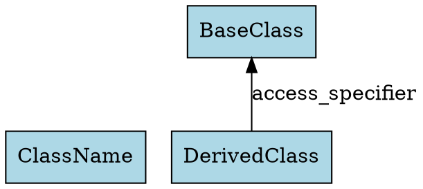

# Usage Examples

## Basic Usage

### 1. Command-Line Extraction

Extract inheritance relationships and generate DOT format:

```bash
./build/inheritance_extractor test.cpp -- > graph.dot
```

Generate PNG visualization:

```bash
dot -Tpng graph.dot -o graph.png
```

### 2. Web Interface

Start the Streamlit application:

```bash
streamlit run main.py
```

Then open your browser to `http://localhost:8501` and upload a C++ file.

## Examples

### Example 1: Basic Inheritance

**Input (test.cpp):**
```cpp
class Animal {
public:
    virtual void speak() {}
};

class Dog : public Animal {
public:
    void speak() override {}
};

class Cat : private Animal {
public:
    void speak() override {}
};
```

**Output:**
- 3 nodes: Animal, Dog, Cat
- 2 edges: 
  - Dog → Animal (public)
  - Cat → Animal (private)

### Example 2: Multiple Inheritance

**Input (test_advanced.cpp):**
```cpp
class Vehicle {
public:
    virtual void move() {}
};

class Engine {
protected:
    virtual void start() {}
};

class Car : public Vehicle, private Engine {
public:
    void drive() {}
};
```

**Output:**
- 3 nodes: Vehicle, Engine, Car
- 2 edges:
  - Car → Vehicle (public)
  - Car → Engine (private)

### Example 3: Deep Hierarchy

**Input:**
```cpp
class Animal {};
class Mammal : public Animal {};
class Dog : public Mammal {};
class Puppy : public Dog {};
```

**Output:**
- 4 nodes: Animal, Mammal, Dog, Puppy
- 3 edges:
  - Mammal → Animal (public)
  - Dog → Mammal (public)
  - Puppy → Dog (public)

## Features

### Supported
- ✅ Single inheritance
- ✅ Multiple inheritance
- ✅ Access specifiers (public, private, protected)
- ✅ Deep inheritance hierarchies
- ✅ Struct inheritance (default public)
- ✅ Class inheritance (default private)

### Ignored
- ❌ Template classes
- ❌ Anonymous classes
- ❌ Forward declarations

## Output Format

The tool generates DOT format with the following structure:



## Graphviz Visualization

The DOT file can be rendered using Graphviz:

```bash
# PNG format
dot -Tpng graph.dot -o graph.png

# SVG format
dot -Tsvg graph.dot -o graph.svg

# PDF format
dot -Tpdf graph.dot -o graph.pdf
```

## Troubleshooting

### Build Issues

If the build fails, ensure you have:
- CMake 3.16+
- LLVM development libraries
- libclang development libraries
- C++17 compiler

### Runtime Issues

If extraction fails:
1. Check that the C++ file is syntactically correct
2. Ensure the file path is correct
3. Try adding `--` before any compiler flags

### Python/Streamlit Issues

If the web interface doesn't work:
1. Install dependencies: `pip install -r requirements.txt`
2. Ensure the extractor is built: `./build.sh`
3. Check that Graphviz is installed: `dot -V`
